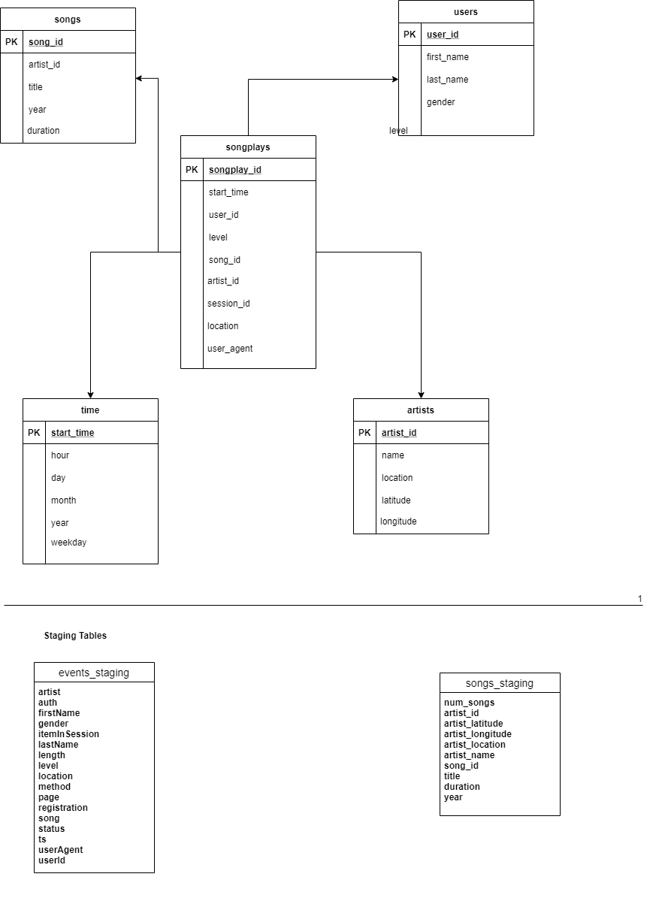

## Introduction
A startup called Sparkify has been collecting data on songs and user activity in JSON format. They are interested in efficiently performing 
song play analysis. Specifically, they want to know which songs do users prefer.

The goal of the current project is to establish a database on cloud, specifically AWS Redshift to enable efficient queries.

## About the Source Data
The dataset has been gathered from [Million Songs Dataset](https://labrosa.ee.columbia.edu/millionsong/) and logs simulated using 
[event simulator](https://github.com/Interana/eventsim)

## Project Description

The project performs the following steps to successfully achieve the goals:

1. Create staging, fact, and dimmension tables
2. Copy raw json from S3 to staging tables in Redshift
3. Populate the fact, and dimensions (star schema) tables

## Database Design


This is called a star schema, which is the industry standard for optimizing the desired queries. The table at the center is the *Fact* table 
(songplays) which contains the foreign keys to the *four dimension* tables. Additionally, distkey choices were made in order to minimize shuffling.Through this design analytical queries such as the following are easy to execute using simple joins.

~~~~sql
SELECT first_name, last_name, COUNT(*) AS counts 
FROM (songplays LEFT JOIN time ON songplays.start_time = time.start_time)
    LEFT JOIN users ON songplays.user_id = users.user_id 
GROUP BY first_name, last_name, weekday 
HAVING time.weekday=5 
ORDER BY counts DESC LIMIT 5;
~~~~

This query would return the top 5 active users on Fridays.

## Usage

### Creating the Redshift Cluster

You can create the redshift cluster using the code provided in `setup_AWS.ipynb` or through AWS UI (in this case skip this step and proceed further)

It would be necessary to set the following configurtion in the `dwh.cfg` file

```
DWH_CLUSTER_TYPE=         e.g. multi-node
DWH_NUM_NODES=            e.g. 4
DWH_NODE_TYPE=            e.g. dc2.large

DWH_IAM_ROLE_NAME=        e.g. dwhRole
DWH_CLUSTER_IDENTIFIER=   e.g. dwhCluster
DWH_DB=                   Database Name
DWH_DB_USER=              Database user
DWH_DB_PASSWORD=          Database Password
DWH_PORT=                 Database Port
```
**Note: You can also create and attach the IAM role through the code in the same notebook**

### Executing the project

To execute the project run

Enter the necesssary configuration in the `dwh.cfg` file, more specifically the following:

In the `Cluster` Section
```
HOST= Redshift host
DB_NAME= Database Name
DB_USER= Database User
DB_PASSWORD= Database Password
DB_PORT= Database Port
```

In the `IAM_ROLE` section
```
ARN= 'arn:aws:iam::xxxxxxxxx:role/xxxxx'
```

In terminal
```python
python create_tables.py
python etl.py
```

**Note: It is necessary to execute the create_tables script before etl as that creates the database and tables.**
